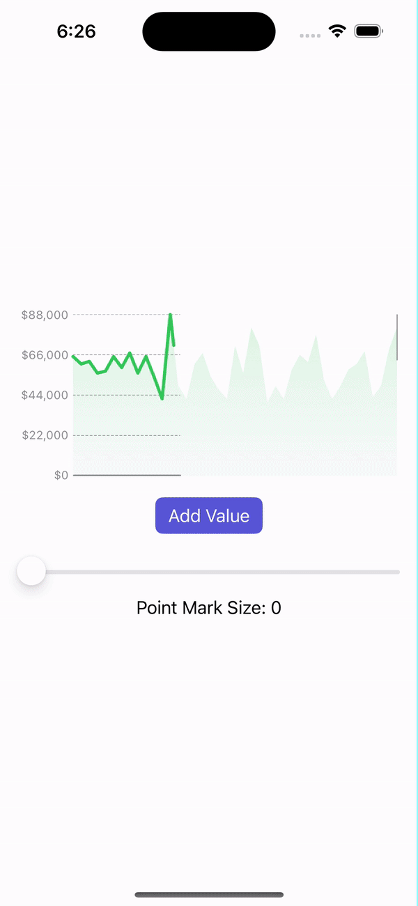

<!-- HEADER -->
<h1> Line Chart </h1>

[][Swift]
[][SwiftUI]
[][iOS]

<!-- BODY -->

## Preview

	

## Description
An interactive and descriptive Line Chart built using SwiftUI.

## Built with:
- Foundation
- SwiftUI

<!-- FOOTER -->
<!-- Permanent links -->
[Swift]: https://www.swift.org
[SwiftUI]: https://developer.apple.com/documentation/swiftui/
[iOS]: https://developer.apple.com/ios/
